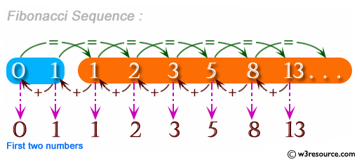

# Express-Review
### Requirements
- On the home page (get "/"), users should see:

- 99 Bottles of beer on the wall"
a link that says "take one down, pass it around"
this should link to /98, where the number represents the number of bottles left.
When a number is given in the url (get "/:number_of_bottles"), users should see:

- The number of bottles of beer on the wall (i.e. 98 Bottles of beer on the wall.)
a link to "take one down, pass it around", where the href is number of bottles in the parameter minus 1.
If there are 0 bottles left, do not show a link to "take one down"`

- Add a link to start over, which directs the user back to the home page.
#### Hints
  `You should use an anchortag with an href to link to the next 'page'`
### Part 2 Fibonacci
`Back in your main app:`

1. Make a basic express app in main-app
2. Add `Fibonnacias` a comment in your application.
3. Create a route 'fibonacci'
4. This route will take one param, the number we will operate on.
5. If the number param is not a fibonacci number, print out `"I can tell this is not a fibonacci number."`
6. If the number is a Fibonacci number print out `"Very good. It is Fibonacci."`
